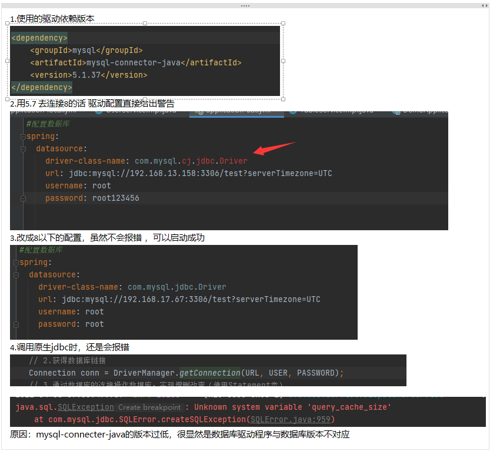

#介绍
Spring Boot + Mybatis + Mysql（主要是用来测试mysql驱动版本的问题）
#测试内容
1.需要测试的是使用mysql8.0的驱动是否能兼容mysql5.7的版本和mysql8.0的版本（测试原生的jdbc和mybatis）
2.需要测试的是使用mysql5.1的驱动是否能兼容mysql5.7的版本和mysql8.0的版本（测试原生的jdbc和mybatis）

#环境1
local的配置文件: 连接的mysql数据库版本是8.0.11;
uat的配置文件：连接mysql的数据库版本是5.7;
pom里面引入的是8.0.20
#测试1.1
url:http://localhost:8080/demo/table/getTableNames 
说明：用原生的jdbc获取该数据库下的表;
url:http://localhost:8080/demo/table/getTableFiles
param:  String tableName   传入的表名
说明：用原生的jdbc获取表里面的字段;
#测试结果1.1
成功
#测试1.2
测试mybatis里面的一些增删改查，连表查询
#测试结果1.2
成功

#环境2
local的配置文件: 连接的mysql数据库版本是8.0.11;
uat的配置文件：连接mysql的数据库版本是5.7;
pom里面引入的是5.1.37
#测试2.1
url:http://localhost:8080/demo/table/getTableNames
说明：用原生的jdbc获取该数据库下的表;
url:http://localhost:8080/demo/table/getTableFiles
param:  String tableName   传入的表名
说明：用原生的jdbc获取表里面的字段;
#测试结果2.1
如图：

失败;

#总结：
使用mysql8.0的驱动可以向下兼容5.7等一些低版本；
而使用mysql5.7的驱动是无法向上兼容的；

